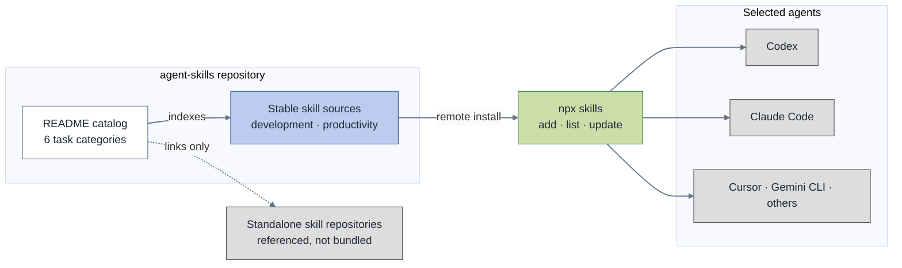

# Repository Structure

The README presents the 20 bundled skills in six task-oriented categories.
Their existing source paths stay under `skills/development/` and
`skills/productivity/` because the Skills CLI records each installed skill's
exact path for future updates. The catalog taxonomy can improve without
breaking that compatibility surface.

Installation has one owner: [`npx skills`](https://github.com/vercel-labs/skills).
The CLI discovers the pack, records remote-source metadata, and manages the
destinations for explicitly selected agents. This repository does not carry
per-harness installation adapters.

Color key: blue is the packaged source, green is the installation and update
path, gray is outside the pack, and white is the reader-facing index. The
README tables are the source of truth for catalog membership.

## Boundaries

- `README.md` owns discovery, task categories, installation, and update
  guidance.
- `skills/<source-category>/<skill-name>/` owns each bundled skill and its
  colocated references, scripts, and assets.
- `npx skills` owns agent selection, installation destinations, lock metadata,
  and on-demand updates.
- Related standalone and external repositories are linked for discovery but
  are not copied into this pack.
