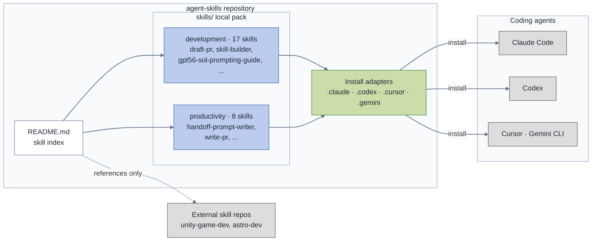

# Repository Structure

How this skill pack is organized and how skills reach a coding agent: local
skills in two categories are indexed by the README, exposed through
per-harness install adapters, and installed into coding agents. External
skill repos are referenced from the index but not packaged here.

Color key: blue = skills packaged in this repo, green = install adapters,
gray = things outside the pack (agents that consume it, external repos that
are only referenced). Edge labels use a fixed light background and dark text
so their text remains legible over lines in both light and dark viewers. Skill
counts are as of 2026-07; the README tables are the source of truth.
