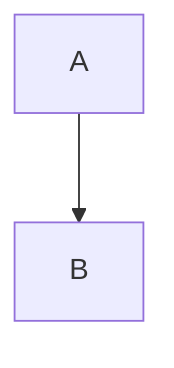

# Mermaid Diagram Design

Mermaid를 "보기 좋게" 그리는 수준을 넘어, 읽는 사람이 빠르게 판단할 수 있는 다이어그램을 만든다.

## Hard Rules (위반 시 렌더 깨짐)

Mermaid 코드를 작성할 때 반드시 지켜야 하는 규칙. 위반하면 렌더링이 의도대로 되지 않는다.

### 1. 줄바꿈: `<br/>` only — `\n` 절대 금지

Mermaid는 `\n`을 줄바꿈으로 해석하지 않는다. `\n`을 쓰면 화면에 **백슬래시+n 문자가 그대로 표시**된다.

```
❌  A["CADI\n광고 판정"]        → 렌더: CADI\n광고 판정
✅  A["CADI<br/>광고 판정"]     → 렌더: CADI
                                        광고 판정
```

적용 범위 — 예외 없음:
- 노드 라벨: `A["텍스트<br/>텍스트"]`
- edge 라벨: `-->|"텍스트<br/>텍스트"|`
- subgraph 제목
- `flowchart`, `graph`, `sequenceDiagram`, `stateDiagram` 등 모든 타입

Mermaid 코드 작성/수정 후 **`\n`이 라벨 안에 남아있지 않은지 반드시 확인**한다. preflight(6단계)에서도 검사하지만, 작성 시점에서부터 `\n`을 쓰지 않는 것이 원칙이다.

### 2. 색상: Professional Palette 사용

`references/mermaid-patterns.md`의 Professional Palette를 기본으로 사용한다. edge는 기본 회색이 아닌 `stroke:#455a64` 이상의 진한 색을 적용한다.

---

## Use This Skill When

- "Mermaid 다이어그램 만들어줘"
- "Mermaid 디자인 개선"
- "아키텍처/흐름도를 Mermaid로 정리"
- 기존 Mermaid가 복잡하거나 렌더 안정성이 낮아 리팩터링이 필요할 때

## Inputs

### Required
- 다이어그램 목적(무엇을 설명하는가)
- 대상 독자(개발자/리더/운영)

### Optional
- 선호 방향 (`TD`/`LR`)
- 색상 제약(브랜드/접근성)
- Confluence 업로드 예정 여부
- 렌더 호스트(`Confluence`/`GitHub`/`Docs`) 및 가용 폭(좁음/보통/넓음)
- 선 가시성 정책(기본: 검정 실선, `stroke:#000000`, `stroke-width:1.8px`)

## Workflow

### 1) 메시지 분해

- 다이어그램 단위 원칙: 핵심 메시지 1개.
- 문서 전체는 여러 다이어그램으로 구성 가능.
- 복합 주제면 메시지 단위로 분할.

### 2) 타입 선택

목적 기준 기본 선택:

- 순차 처리/분기: `flowchart`
- 상호작용/요청-응답: `sequenceDiagram`
- 계층/책임 분리: `flowchart + subgraph`, `architecture`, `block`
- 상태 전이: `stateDiagram`

패턴 템플릿은 `references/mermaid-patterns.md`에서 선택한다.

### 3) 구조 초안

- 노드: 6~12개 권장
- 깊이: 3단계 이내 권장
- 엣지 라벨: 동사 중심 (`validate`, `emit`, `drop`)
- 경계: `subgraph`로 역할/레이어를 분리
- 교차 엣지 최소화: 한 노드의 fan-out 3개 초과 시 분해 검토
- 긴 문장 라벨은 설명 문단으로 이동하고, 다이어그램 라벨은 축약
- 줄바꿈은 `<br/>` only (Hard Rules 참조)

### 3-1) 겹침 위험 진단 (필수)

- 아래 조건 중 하나라도 만족하면 `overlap risk=high`로 본다.
  - 노드 12+ 또는 엣지 16+
  - `LR`에서 긴 라벨 노드가 4개 이상
  - 서로 다른 서브그래프를 가로지르는 엣지가 다수
- 고위험이면 레이아웃 튜닝 전에 먼저 구조를 단순화한다.

### 3-2) 겹침 완화 우선순위 (필수)

1. 라벨 축약: `<b>`, `<i>` 장식 태그를 제거하고 핵심 명사/동사만 남긴다.
2. 공통 노드 통합: 중복 terminal/drop/error 노드를 공유 노드로 합친다.
3. 방향 전환: `LR` 과밀이면 `TB/TD`로 바꾼다.
4. 메시지 분리: 2개 주제가 섞이면 다이어그램을 2개로 분할한다.
5. spacing 조정: `nodeSpacing`, `rankSpacing`은 마지막 단계에서 조정한다.

### 3-3) 선 가시성 하드닝 (필수)

- 색상 노드를 사용하는 `flowchart`/`graph`는 기본 edge 스타일을 명시한다.
  - 권장: `linkStyle default stroke:#000000,stroke-width:1.8px;`
- 옅은 배경(녹색/분홍/노랑 fill) 위에서 기본 회색 edge는 가독성이 떨어진다.
- `classDef`/`style`로 노드 색상을 준 경우, edge 색상은 반드시 별도 지정한다.
- 점선 edge(`-.->`)를 유지하더라도 색상/두께는 동일하게 고정한다.

### 4) 설정(frontmatter) 고정

신규 작성은 directives 대신 frontmatter를 우선 사용한다.



- 복잡한 그래프는 `layout: elk` 검토
- Confluence처럼 가로폭이 좁은 호스트에서는 dense diagram 기본 방향을 `TD/TB`로 둔다
- 호스트가 일부 config를 무시하면 결과 보고에 명시

### 5) 시각/접근성 정리

- Hard Rules(상단) 준수: `\n` 금지 + Professional Palette 사용
- 색상만 의존하지 않는다. 라벨/선스타일(실선/점선)도 같이 사용
- 텍스트 강조 태그(`<b>`, `<i>`) 과다 사용 금지 (박스 폭 증가 + 가독성 저하)
- 장식용 노드/엣지 제거
- 접근성 메타데이터 필요 시 `accTitle`, `accDescr`를 포함

### 6) 파서/렌더 preflight

- **`\n` 잔존 검사** (Hard Rules #1 위반 여부): 라벨 안에 `\n`이 남아있으면 `<br/>`로 치환
- `flowchart`에서 `end` 토큰 오인식 가능성 점검
- `o-`, `x-` edge head 오인식 점검
- 코멘트는 줄 시작 `%%` 규칙 준수
- `subgraph` direction이 외부 연결로 무시되는 구조인지 점검
- `sequenceDiagram`은 `participant`를 명시해 순서 오해를 줄인다
- 탭 문자는 공백으로 치환
- 문서 저장 후 `scripts/assess_mermaid_density.sh <markdown-file>`로 밀도/겹침 위험을 먼저 점검한다
- 밀도 점검 결과에서 `contrast_risk=high` 또는 `edge_style=absent`가 있으면 수정 후 재점검한다
- 문서 저장 후 `scripts/validate_mermaid_markdown.sh <markdown-file>`를 반드시 실행한다
- 검증 실패 시 에러를 수정하고, `MERMAID_VALIDATE_OK`가 나올 때까지 반복한다

### 7) 복잡도 제어

- 노드 15+ 또는 edge 과다 시 다이어그램 분할
- 하나의 다이어그램에 "구조 + 매핑"이 동시에 있으면 분리한다 (예: `컨테이너 구조`, `endpoint 매핑`)
- `Funnel`은 stage별 drop/error를 개별 노드로 늘리지 말고 공통 terminal로 합친다
- 대형 그래프는 `layout: elk` 우선 검토
- 환경 지원 시 `maxTextSize`, `maxEdges` 가드 사용

### 8) Confluence 연계

- Mermaid 원문 설계/검증은 이 스킬이 담당
- Confluence 매크로 변환/업로드는 `upload-markdown-to-confluence` 스킬이 담당
- Confluence 대상이면 결과에 "매크로 검증 필요"를 포함
- Confluence 대상이면 frontmatter가 무시될 수 있으므로, 구조 단순화(분할/축약) 결과를 우선 신뢰한다

## Output Contract

반드시 아래 4가지를 함께 제공한다.

1. 개선된 Mermaid 코드 블록
2. 개선 포인트 3~6개
3. 선택한 패턴명과 이유 1문장
4. preflight 결과(밀도 진단 + 렌더 검증: 통과/주의)

추가로, markdown 파일 수정 작업이면 아래를 함께 제공한다.

- 실행한 검증 명령
- 실행한 밀도 점검 명령
- 최종 검증 결과(`MERMAID_VALIDATE_OK ...`)

## Quick Checklist

- 다이어그램 단위 메시지가 명확한가
- 목적에 맞는 타입을 선택했는가
- frontmatter 설정을 적용했는가
- **Hard Rules 위반 없는가** (`\n` 금지 + Professional Palette)
- 색상 + 비색상 신호가 함께 있는가
- 겹침 위험(노드/엣지/긴 라벨)을 먼저 줄였는가
- edge가 배경색 위에서도 명확하게 보이는가(`linkStyle default` 적용 여부)
- 파서 브레이커를 점검했는가
- 읽는 순서가 자연스러운가
