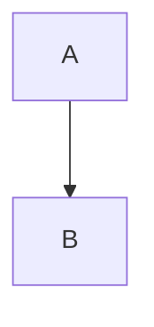

# Mermaid Diagram Design

Use this skill to produce Mermaid diagrams that help the reader understand a
system, workflow, or decision quickly. The goal is not only to make the diagram
look polished. The diagram must reduce ambiguity and make the main message easy
to verify.

All reusable instructions, examples, labels, and outputs in this skill must be
written in English unless the user explicitly asks for another language. Use
neutral sample domains and never include private company names, internal product
names, customer data, incident details, or unreleased project context.

## Hard Rules

These rules apply whenever you create or edit Mermaid code. Violations often
render incorrectly or create misleading diagrams.

### 1. Use `<br/>` For Line Breaks, Never `\n`

Mermaid does not interpret `\n` as a visual line break in labels. It renders the
backslash and `n` characters literally.

```text
Bad:   A["Review\nDecision"]      renders as: Review\nDecision
Good:  A["Review<br/>Decision"]   renders as two lines
```

Apply this everywhere:

- Node labels: `A["First line<br/>Second line"]`
- Edge labels: `-->|"First line<br/>Second line"|`
- Subgraph titles
- Every diagram type, including `flowchart`, `graph`, `sequenceDiagram`, and
  `stateDiagram`

After writing or editing Mermaid code, check that no label still contains a
literal `\n`. The preflight step also checks this, but the safest habit is to
avoid `\n` from the start.

### 2. Use The Professional Palette

Use the Professional Color Palette from `references/mermaid-patterns.md` by
default. Do not rely on Mermaid's default pale gray edges. Set edges to a dark
neutral color such as `stroke:#455a64` or darker.

## Use This Skill When

- The user asks for a Mermaid diagram.
- The user asks for a flowchart, sequence diagram, state diagram, or architecture
  diagram.
- Existing Mermaid code is too dense, unstable, hard to read, or likely to
  overlap.
- A document needs a diagram that supports a specific reader decision.

## Inputs

### Required

- Diagram purpose: what the diagram must explain.
- Target reader: developer, reviewer, operator, product lead, or another
  audience.

### Optional

- Preferred direction: `TD`, `TB`, or `LR`.
- Color constraints, including brand or accessibility needs.
- Target renderer: `Confluence`, `GitHub`, `Docs`, or another host.
- Available width: narrow, normal, or wide.
- Whether the diagram will be copied into Confluence.
- Edge visibility policy. Default: dark solid edges with
  `stroke:#000000,stroke-width:1.8px`.

## Workflow

### 1. Split By Message

- Use one primary message per diagram.
- Split complex topics into multiple diagrams instead of forcing one large graph.
- If the document needs several diagrams, give each one a distinct purpose.

### 2. Choose The Diagram Type

Choose by purpose:

- Sequential process or branching workflow: `flowchart`
- Request and response timeline: `sequenceDiagram`
- Layered responsibility or architecture boundary: `flowchart + subgraph`,
  `architecture`, or `block`
- State transitions: `stateDiagram`

Select a reusable pattern from `references/mermaid-patterns.md` when one fits.

### 3. Draft The Structure

- Prefer 6-12 nodes.
- Keep depth to three levels or fewer when possible.
- Use verb-focused edge labels such as `validate`, `emit`, or `drop`.
- Use `subgraph` only for meaningful boundaries such as ownership, layer, or
  runtime environment.
- Reduce crossing edges. If one node fans out to more than three paths, consider
  splitting the diagram.
- Move long explanations into prose. Keep diagram labels short.
- Use `<br/>` for label line breaks.

### 3.1. Diagnose Overlap Risk

Treat overlap risk as high when any condition is true:

- 12 or more nodes, or 16 or more edges.
- Four or more long labels in an `LR` diagram.
- Many edges cross between different subgraphs.

When risk is high, simplify the structure before tuning layout spacing.

### 3.2. Reduce Overlap In This Order

1. Shorten labels. Remove decorative `<b>` or `<i>` tags and keep only the core
   noun or verb phrase.
2. Merge duplicate terminal, drop, or error nodes into shared nodes.
3. Switch direction. If `LR` is crowded, use `TB` or `TD`.
4. Split mixed messages into two diagrams.
5. Tune `nodeSpacing` and `rankSpacing` only after the structure is simpler.

### 3.3. Harden Edge Visibility

- For `flowchart` or `graph` diagrams with colored nodes, set a default edge
  style explicitly.
- Recommended: `linkStyle default stroke:#000000,stroke-width:1.8px;`
- Mermaid's default gray edges can disappear on light green, pink, yellow, or
  blue fills.
- If you use `classDef` or `style` for node colors, define edge color separately.
- Dotted edges such as `-.->` should use the same explicit color and width.

### 4. Prefer Frontmatter Configuration

For new diagrams, prefer Mermaid frontmatter over inline directives.



- Consider `layout: elk` for complex graphs.
- For narrow renderers such as Confluence, prefer `TD` or `TB` for dense
  diagrams.
- If the host ignores part of the Mermaid config, say so in the result.

### 5. Improve Visual Clarity And Accessibility

- Follow the hard rules: no label `\n`, and use the Professional Palette.
- Do not rely on color alone. Pair color with labels or line style.
- Avoid excessive `<b>` and `<i>` tags because they increase box width and reduce
  scanability.
- Remove decorative nodes and edges.
- Include `accTitle` and `accDescr` when the output document benefits from
  accessibility metadata.

### 6. Parser And Render Preflight

- Check for literal `\n` inside labels and replace it with `<br/>`.
- Watch for lower-case `end` being parsed as a flowchart terminator.
- Watch for `o-` or `x-` being parsed as special edge heads.
- Mermaid comments must start with `%%` at the beginning of a line.
- Check whether external links make `subgraph` direction ineffective.
- In `sequenceDiagram`, declare `participant` entries to avoid ordering
  surprises.
- Replace tab characters with spaces.
- After saving a markdown file, run
  `scripts/assess_mermaid_density.sh <markdown-file>` first.
- If density output reports `contrast_risk=high` or `edge_style=absent`, fix the
  diagram and rerun the density check.
- Then run `scripts/validate_mermaid_markdown.sh <markdown-file>`.
- Fix errors and repeat until validation prints `MERMAID_VALIDATE_OK`.

### 7. Control Complexity

- Split diagrams with 15 or more nodes or excessive edges.
- Split diagrams that mix structural topology with detailed mapping.
- For funnel diagrams, share terminal nodes instead of creating separate
  drop/error nodes for every stage.
- Consider `layout: elk` for large graphs.
- Use `maxTextSize` and `maxEdges` guards when the target environment supports
  them.

### 8. Confluence Handoff

- This skill handles Mermaid source design and validation.
- A Confluence publishing skill should handle macro conversion and upload.
- If Confluence is the target, include "macro validation required" in the result.
- Because Confluence may ignore Mermaid frontmatter, prioritize simpler
  structure, shorter labels, and diagram splitting over config-only fixes.

## Output Contract

Always provide these four items:

1. The improved Mermaid code block.
2. Three to six concise improvement notes.
3. The selected pattern name and one sentence explaining why it fits.
4. Preflight results: density diagnosis and render validation status.

When editing a markdown file, also provide:

- The validation command you ran.
- The density check command you ran.
- The final validation result, such as `MERMAID_VALIDATE_OK ...`.

## Quick Checklist

- Is the diagram's single message clear?
- Did you choose the diagram type by purpose?
- Did you apply frontmatter configuration where useful?
- Are the hard rules satisfied: no label `\n`, Professional Palette applied?
- Does the diagram use non-color signals as well as color?
- Did you reduce node, edge, and long-label overlap risk before tuning spacing?
- Are edges visible on colored backgrounds?
- Did you check parser breakers?
- Is the reading order natural for the target audience?
