# Mermaid Reusable Patterns (v2)

## 1) Type Selection Matrix

- Workflow/funnel/branching: `flowchart`
- Interaction timeline: `sequenceDiagram`
- Layered architecture/context boundary: `flowchart + subgraph`, `architecture`, `block`
- State transition: `stateDiagram`

## 2) Frontmatter Presets

### 2-1) Baseline


### 2-2) Dense Graph (ELK)

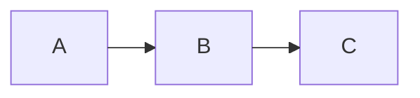

### 2-3) Confluence Dense (Dagre + Spacing)

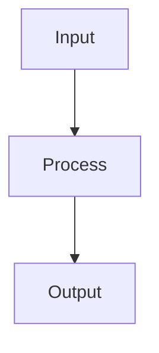

### 2-4) Edge Visibility Baseline (Dark Edges)

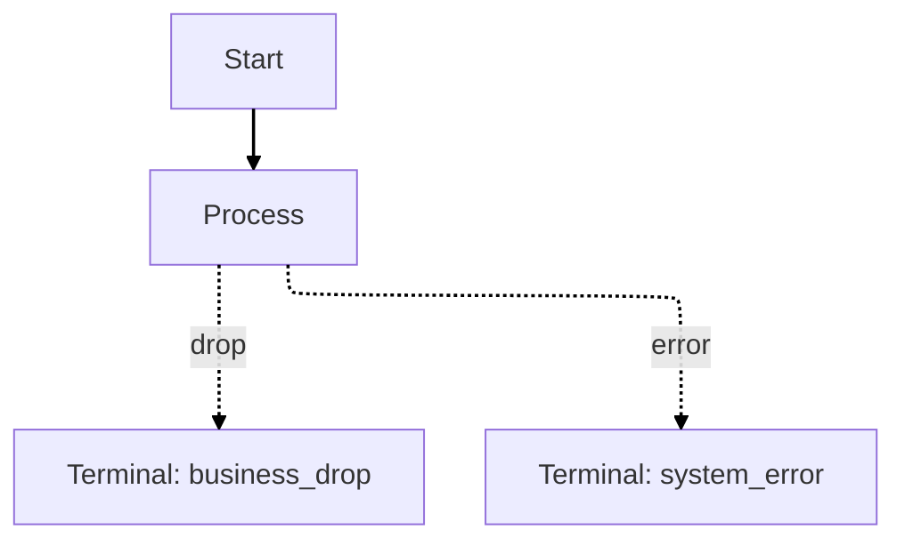

### 2-5) Sequence with Numbers

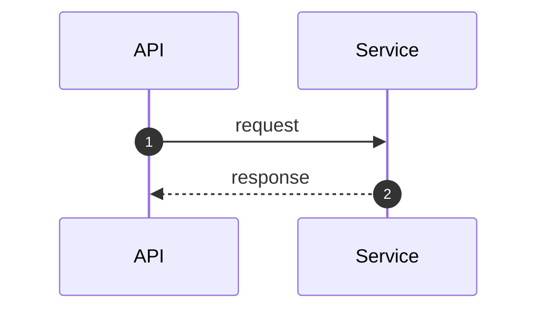

## 3) Professional Color Palette (기본)

Material Design 기반의 절제된 팔레트. 모든 다이어그램에서 이 classDef를 기본으로 사용한다.

### 3-1) Semantic (상태 표현)

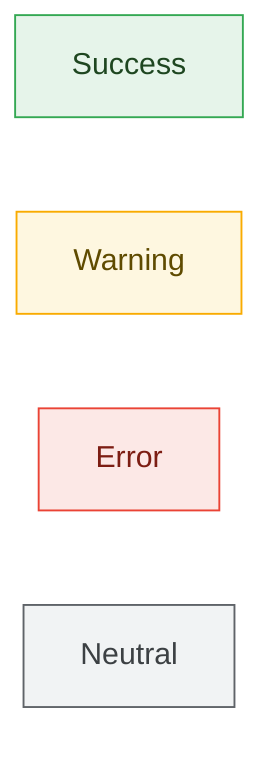

### 3-2) Layer (아키텍처 레이어)

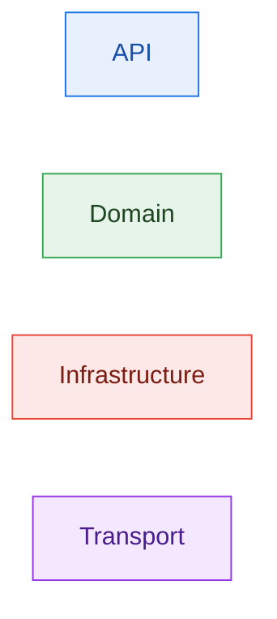

### 3-3) Pipeline (순서/단계 표현)


### 3-4) 전체 classDef 복사용

```
  classDef success fill:#e6f4ea,stroke:#34a853,color:#1e4620;
  classDef warning fill:#fef7e0,stroke:#f9ab00,color:#5f4b00;
  classDef error fill:#fce8e6,stroke:#ea4335,color:#7c1d13;
  classDef neutral fill:#f1f3f4,stroke:#5f6368,color:#3c4043;
  classDef primary fill:#e8f0fe,stroke:#1a73e8,color:#174ea6;
  classDef purple fill:#f3e8fd,stroke:#9334e6,color:#4a1d8e;
  linkStyle default stroke:#455a64,stroke-width:1.8px;
```

### 색상 사용 규칙

- 색상만으로 의미를 전달하지 않는다. 라벨/선스타일(실선, 점선)도 같이 사용
- edge는 기본 회색이 아닌 `stroke:#455a64`(blue-grey 700)을 사용
- 노드 fill은 옅은 톤, stroke는 진한 톤, color(텍스트)는 가장 진한 톤
- 한 다이어그램에 4색 이하 권장. 색이 많으면 라벨로 구분

## 4) Core Patterns

### 4-1) Linear Pipeline

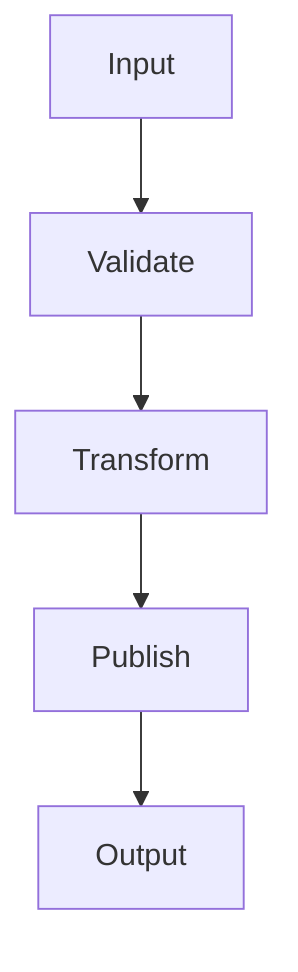

### 4-2) Layered Architecture

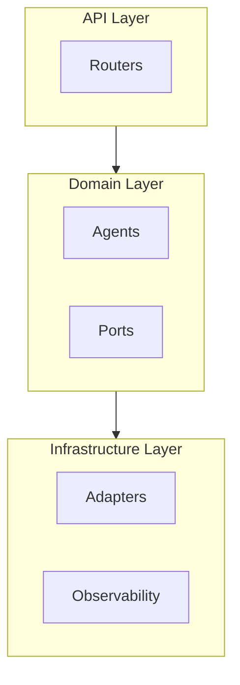

### 4-3) Before/After Comparison

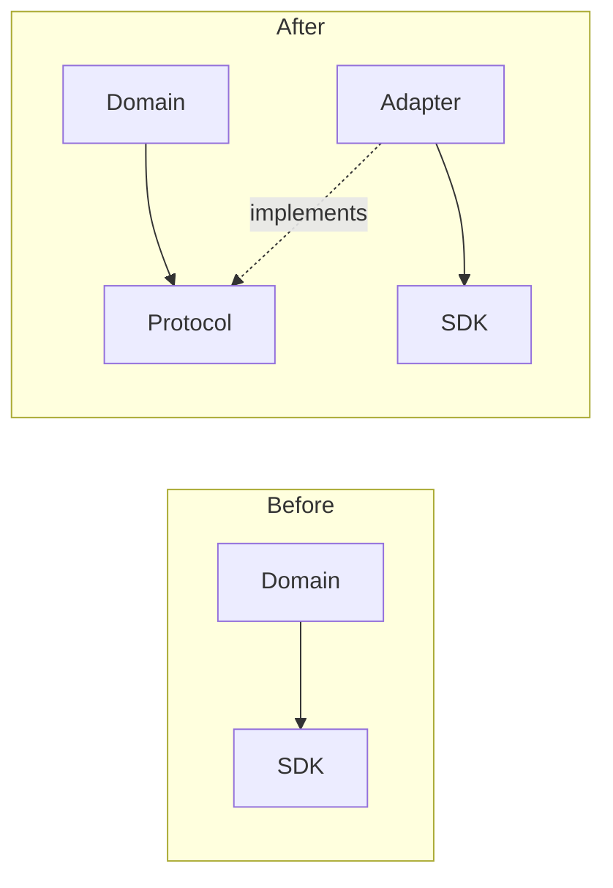

### 4-4) Funnel + Terminal

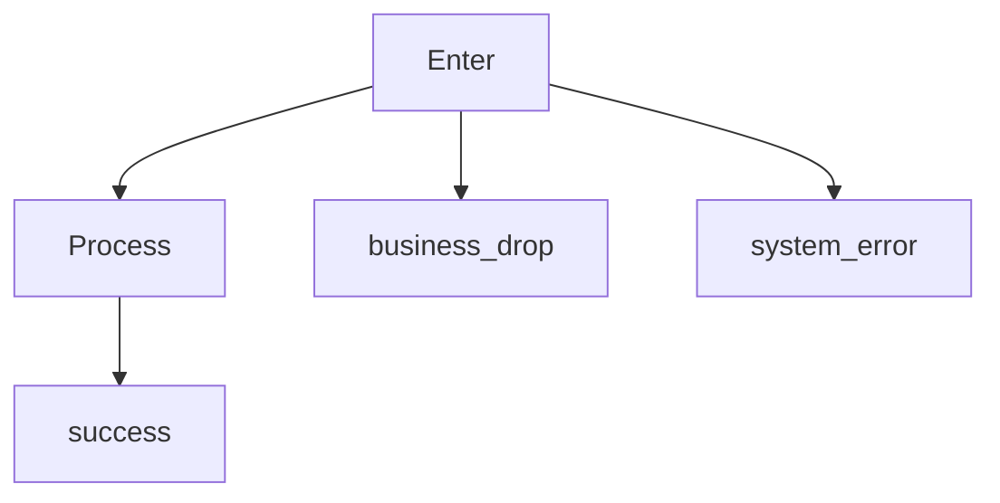

### 4-5) Producer -> Transport -> Consumer

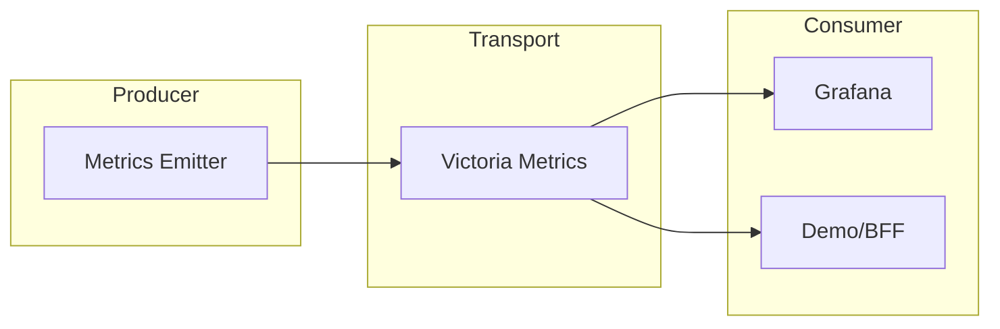

### 4-6) Sequence Interaction

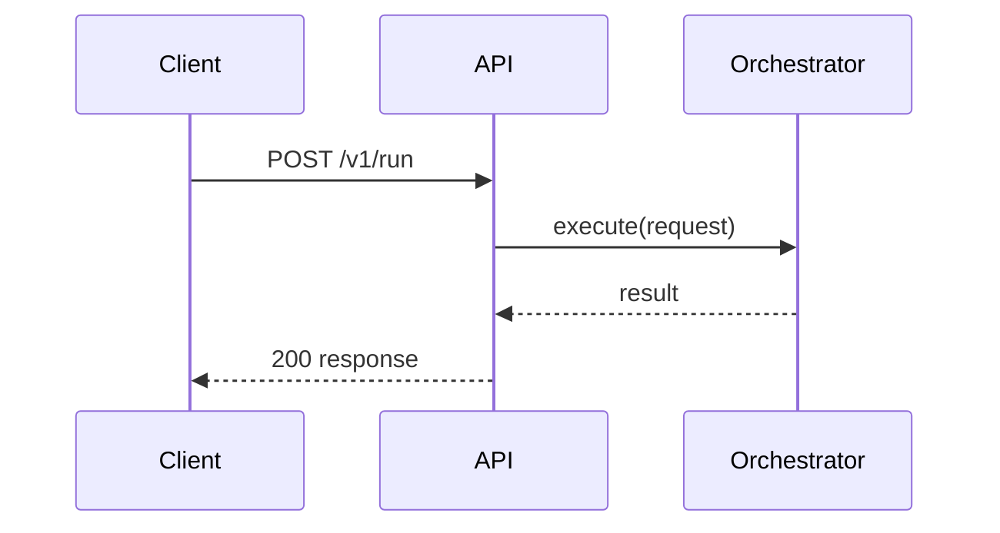

### 4-7) State Transition

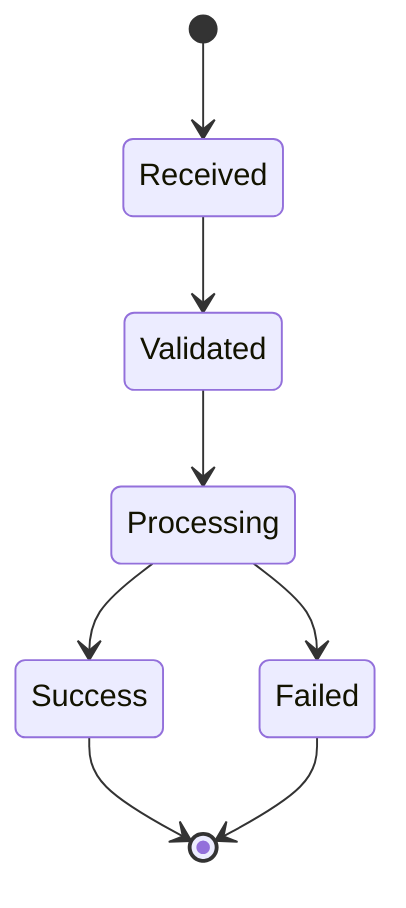

### 4-8) Compact Funnel (Shared Terminal)

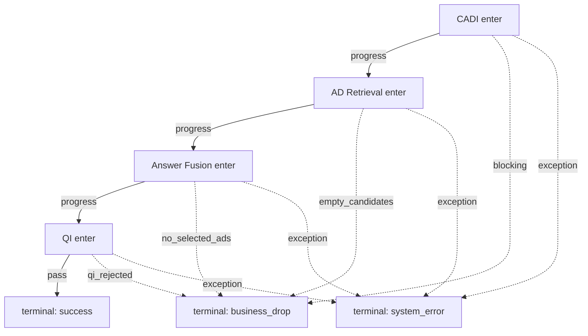

### 4-9) Split Dense Diagram (Topology + Mapping)

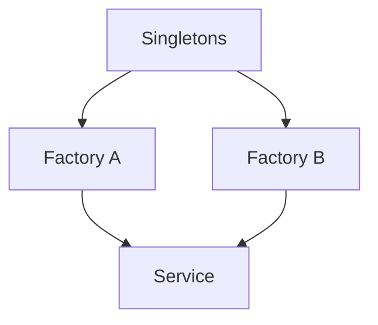

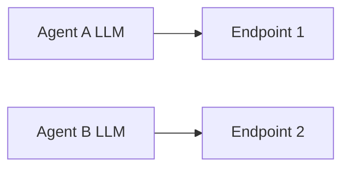

## 5) Preflight Checklist

- **노드/edge/subgraph 라벨에 `\n`이 없는가** (있으면 `<br/>`로 치환. `\n`은 줄바꿈이 아닌 리터럴 텍스트로 렌더됨)
- lower-case `end`가 라벨로 쓰여 파싱 오류를 유발하지 않는가
- `o-`/`x-`가 의도치 않은 edge 표현으로 해석되지 않는가
- 코멘트가 `%%` 규칙을 지키는가
- 외부 링크 때문에 `subgraph` direction이 무시되는 구조는 아닌가
- `sequenceDiagram`에서 participant를 명시했는가
- 탭 문자가 섞여 있지 않은가
- 노드 15개 이상이면 분할 또는 `elk` 전환을 검토했는가
- 접근성 메타데이터(`accTitle`, `accDescr`)가 필요한 문서인지 검토했는가

필수 검증 명령:

```bash
~/.agents/skills/mermaid-diagram-design/scripts/assess_mermaid_density.sh <markdown-file>
~/.agents/skills/mermaid-diagram-design/scripts/validate_mermaid_markdown.sh <markdown-file>
```

성공 기준:

- 출력이 `MERMAID_VALIDATE_OK ...`
- 밀도 점검에서 고위험 블록이 없거나, 고위험 블록에 대해 분할/축약 조치를 완료
- 실패 시 다이어그램 수정 후 재실행

## 6) Aesthetic Rules

- 다이어그램 단위 메시지 1개
- 순차 흐름은 `TD`, 비교는 `LR`를 기본
- 노드 수 6~12개 권장
- 긴 라벨은 `<br/>` 사용
- 장식용 노드/엣지 제거
- `LR`에서 겹침이 발생하면 먼저 `TD/TB`로 전환
- 구조 설명과 매핑 설명이 함께 있으면 다이어그램을 분리
