# Mermaid Reusable Patterns (v2)

## Table of Contents

- Type Selection Matrix
- Frontmatter Presets
- Accessible Fallback Palette
- Core Patterns
- Preflight Checklist
- Aesthetic Rules

## 1) Type Selection Matrix

- Workflow/funnel/branching: `flowchart`
- Interaction timeline: `sequenceDiagram`
- Layered architecture/context boundary: `flowchart + subgraph`, `architecture`, `block`
- State transition: `stateDiagram`

## 2) Frontmatter Presets

### 2-1) Baseline


### 2-2) Dense Graph (ELK)

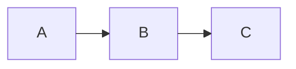

### 2-3) Confluence Dense (Dagre + Spacing)

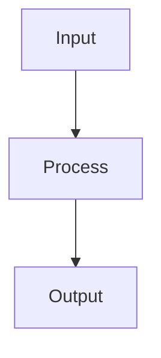

### 2-4) Edge Visibility Baseline (Dark Edges)

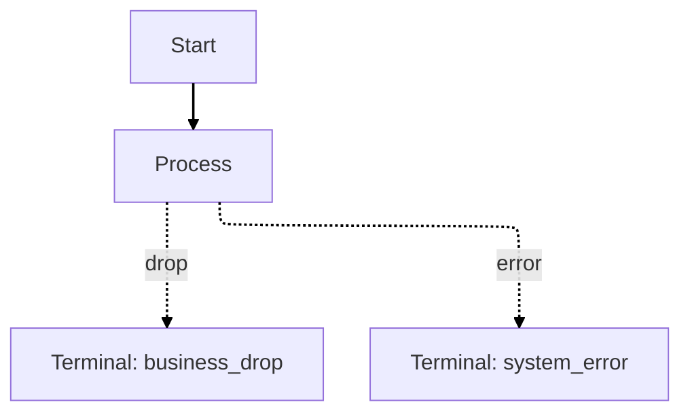

### 2-5) Sequence with Numbers

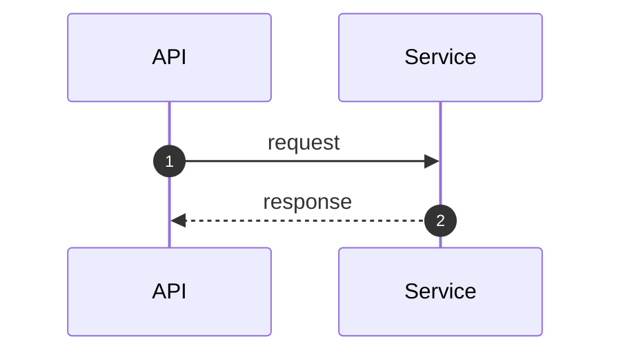

## 3) Accessible Fallback Palette

Use this restrained Material Design based palette when color carries meaning and
the destination has no established visual system. An unstyled diagram is often
more portable; do not add every semantic color merely because definitions exist.

### 3-1) Semantic States

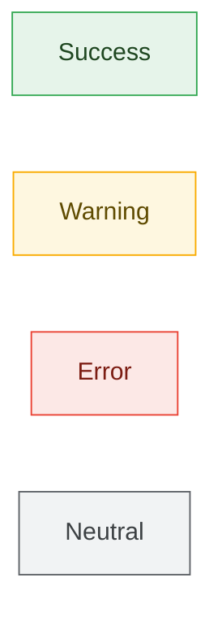

### 3-2) Architecture Layers

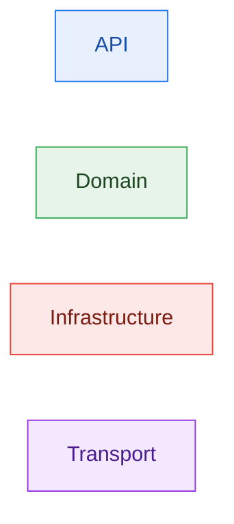

### 3-3) Pipeline Steps


### 3-4) Copyable Class Definitions

```
  classDef success fill:#e6f4ea,stroke:#34a853,color:#1e4620;
  classDef warning fill:#fef7e0,stroke:#f9ab00,color:#5f4b00;
  classDef error fill:#fce8e6,stroke:#ea4335,color:#7c1d13;
  classDef neutral fill:#f1f3f4,stroke:#5f6368,color:#3c4043;
  classDef primary fill:#e8f0fe,stroke:#1a73e8,color:#174ea6;
  classDef purple fill:#f3e8fd,stroke:#9334e6,color:#4a1d8e;
  linkStyle default stroke:#455a64,stroke-width:1.8px;
```

### Color Rules

- Do not communicate meaning with color alone. Pair color with labels or line
  style.
- Use `stroke:#455a64` (blue-grey 700) for edges instead of the default gray.
- Use light fills, darker strokes, and the darkest tone for text.
- Prefer four or fewer colors in one diagram. When more categories are needed,
  distinguish them with labels.

## 4) Core Patterns

### 4-1) Linear Pipeline

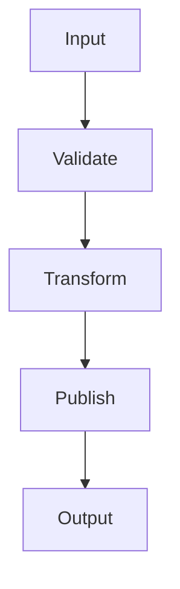

### 4-2) Layered Architecture

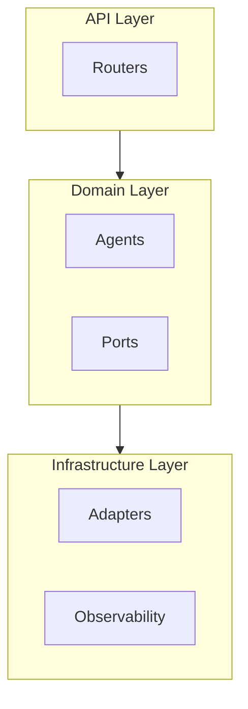

### 4-3) Before/After Comparison

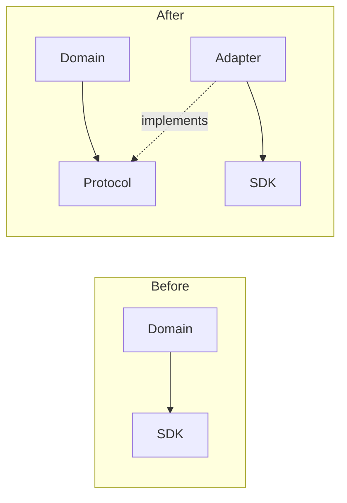

### 4-4) Funnel + Terminal

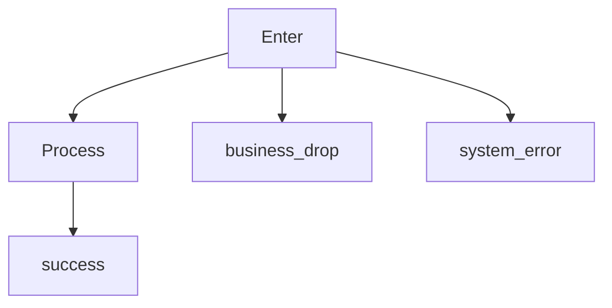

### 4-5) Producer -> Transport -> Consumer

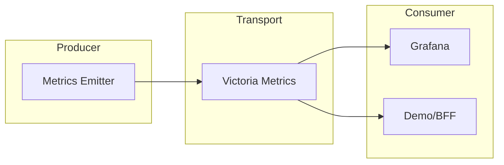

### 4-6) Sequence Interaction

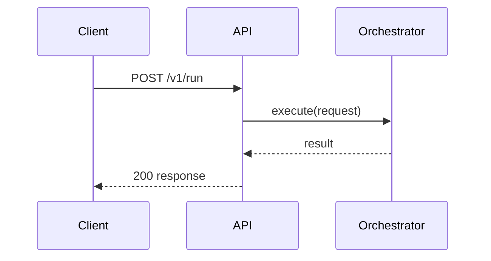

### 4-7) State Transition

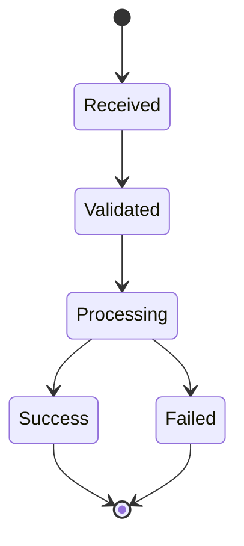

### 4-8) Compact Funnel (Shared Terminal)

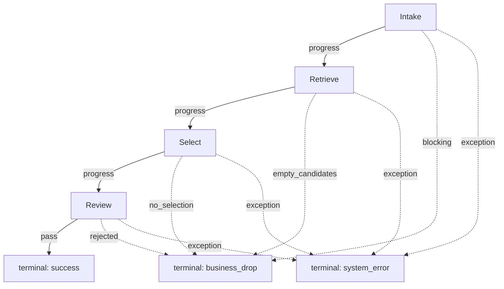

### 4-9) Split Dense Diagram (Topology + Mapping)

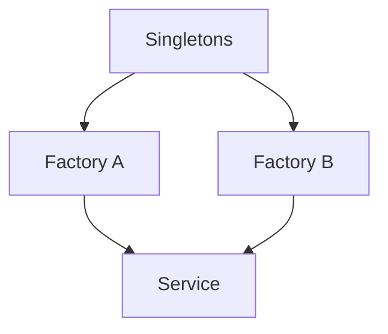

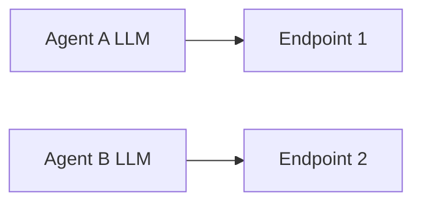

## 5) Preflight Checklist

- **Do node, edge, and subgraph labels avoid literal `\n`?** Replace it with
  `<br/>` when present. Mermaid renders `\n` as literal text, not a line break.
- Is lower-case `end` avoided as a label where it could cause a parse error?
- Are `o-` and `x-` avoided when they could be parsed as special edge heads?
- Do comments follow the `%%` line-start rule?
- Could external links cause `subgraph` direction to be ignored?
- Does each `sequenceDiagram` declare participants explicitly?
- Are tab characters absent?
- If the diagram has 15 or more nodes, did you split it or consider `elk`?
- Does the target document need accessibility metadata such as `accTitle` and
  `accDescr`?

For repository markdown files, resolve `MERMAID_SKILL_DIR` to the directory that
contains this skill's `SKILL.md`, then run with an absolute target path:

```bash
MERMAID_SKILL_DIR="<absolute path to the installed mermaid-diagram-design skill>"
"$MERMAID_SKILL_DIR/scripts/assess_mermaid_density.sh" "<absolute markdown path>"
"$MERMAID_SKILL_DIR/scripts/validate_mermaid_markdown.sh" "<absolute markdown path>"
```

Success criteria:

- Validation output includes `MERMAID_VALIDATE_OK ...`.
- Density warnings were visually reviewed; required content was not removed just
  to satisfy a heuristic threshold.
- On failure, fix the diagram and rerun the checks.

## 6) Aesthetic Rules

- Use one message per diagram.
- Choose direction from reader path, label length, renderer width, and density.
- Use `LR` for comparisons, parallel lanes, ownership boundaries, and handoffs.
- Use `TD` or `TB` for short sequential paths, funnels, and decision trees.
- Avoid default `LR` when labels are long, branches are many, or the renderer is
  narrow.
- Avoid tall `TD` or `TB` scroll tunnels; split by phase or collapse repeated
  steps.
- Prefer 6-12 nodes.
- Use `<br/>` for long labels.
- Remove decorative nodes and edges.
- Simplify, split, or switch direction before tuning spacing.
- Split the diagram when structure and mapping details are mixed.
