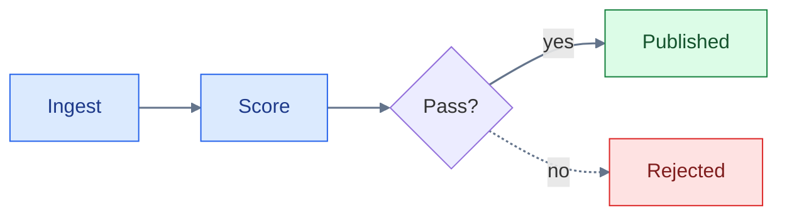
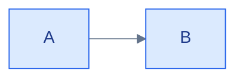

# Mermaid Color And Style

Palettes, theming, dark-mode survival, and visual hierarchy. Contrast ratios below were computed with the WCAG formula; palette hues derive from Paul Tol's colorblind-safe schemes and Okabe-Ito accents.

## Contents

- When to color at all
- Ready-made palettes
- Theming with themeVariables
- Dark-mode survival
- Visual hierarchy without color
- Sequence, state, and subgraph styling

## When To Color At All

An unstyled diagram inherits the host theme and survives every background — it is the most portable choice and often the best one. Add color only when it encodes meaning (status, ownership, layer), and always pair it with the label or line style so the meaning survives grayscale and color-blindness. Four colors per diagram is a practical ceiling; beyond that, distinguish with labels.

## Ready-Made Palettes

Pattern: light fill + darker same-hue stroke + darkest-hue text. Every pair below passes WCAG AA (text/fill ≥ 4.5:1 — these measure ≥ 8:1; stroke/fill ≥ 3:1), and the light fills keep dark text readable even if a dark host theme restyles surrounding chrome.

### Semantic states

```text
classDef success fill:#dcfce7,stroke:#15803d,color:#14532d;
classDef warning fill:#fef9c3,stroke:#a16207,color:#713f12;
classDef error   fill:#fee2e2,stroke:#dc2626,color:#7f1d1d;
classDef info    fill:#dbeafe,stroke:#2563eb,color:#1e3a8a;
classDef neutral fill:#f3f4f6,stroke:#6b7280,color:#1f2937;
linkStyle default stroke:#64748b,stroke-width:1.6px;
```

### Categorical (layers, teams, zones — up to 6)

Fills from Tol's "pale" scheme (designed as background for black text), strokes darkened to ≥ 3:1 against their fill:

```text
classDef cat1 fill:#BBCCEE,stroke:#336699,color:#1f2937;
classDef cat2 fill:#CCDDAA,stroke:#228833,color:#1f2937;
classDef cat3 fill:#FFCCCC,stroke:#BB5566,color:#1f2937;
classDef cat4 fill:#EEEEBB,stroke:#997700,color:#1f2937;
classDef cat5 fill:#CCEEFF,stroke:#117799,color:#1f2937;
classDef cat6 fill:#DDDDDD,stroke:#555555,color:#1f2937;
```

### Line/accent colors (edges, emphasis strokes)

- Default edge on any background: `#64748b` or `#808080` (≥ 3:1 on both white and GitHub-dark `#0d1117`).
- Strong accents that pass on both light and dark backgrounds: Okabe-Ito blue `#0072B2` and vermillion `#D55E00`.
- Avoid pure black edges (invisible-adjacent on dark hosts) and pure yellow `#F0E442` on white (1.3:1).

Usage:



## Theming With themeVariables

Only the `base` theme is customizable, and the engine accepts **hex colors only** (`red` fails silently). Prefer `classDef` for a few meaningful nodes; reach for `themeVariables` when the whole diagram (all nodes, edges, subgraph fills) must match a document's visual language:



Derived values cascade: setting `primaryColor` recalculates borders and secondary/tertiary colors, so start with `primaryColor` + `lineColor` and add overrides only where the derived result fails. Named themes for quick fit: `neutral` for print/monochrome docs, `dark` for dark-only sites, `forest`/`default` otherwise. `look: handDrawn` signals "draft/proposal" in RFCs; keep `classic` for reference docs.

Flowchart edge labels need a separate contrast pair. `edgeLabelBackground` sets the box behind labels such as `-->|install|`; `textColor` controls text drawn over the diagram background, including those labels. Set both whenever the diagram hardcodes node or line colors, then render once on a light canvas and once on a dark canvas. Setting only the background can inherit unreadable host-theme text, while setting only the text leaves lines visible through the label.

## Dark-Mode Survival

GitHub (and similar hosts) auto-switch Mermaid's theme with the viewer's mode **only when the diagram sets no explicit theme or colors**. Two safe strategies:

1. **No colors at all** — fully adaptive, best default.
2. **Self-contained triplets** — every `classDef` sets `fill` + `stroke` + `color` together (as the palettes above do), so contrast never depends on the host's text or background defaults.

Never set a fill without also setting `color`: a hardcoded light fill plus the dark theme's near-white default text is the classic unreadable-node bug. Mid-gray edges (`#64748b`/`#808080`) stay visible on both backgrounds. For labeled edges, use a fixed light `edgeLabelBackground` with dark `textColor` or an equivalently verified pair; a transparent label background lets the edge compete with the text.

## Visual Hierarchy Without Color

- Main path: thick edges `A ==> B`, or `linkStyle 0,3 stroke-width:2.5px;` on the main-path indices.
- Secondary/async/failure paths: dotted edges `-.->` with a verb label.
- De-emphasized grouping: an invisible wrapper — `classDef ghost fill:transparent,stroke:transparent;` applied to a subgraph id clusters nodes without drawing a box.
- Emphasis inside labels: markdown strings ``["`**Name** — detail`"]`` rather than `<b>` tags (bold HTML tags widen boxes unpredictably).
- Shape encodes role for free: `[(db)]` cylinders, `[[subroutine]]`, `{decision}`, `((start/stop))` — readers parse these before any color.

## Sequence, State, And Subgraph Styling

- Sequence diagrams have no `classDef`. Group participants with `box rgb(219,234,254) Frontend ... end` (rgb/rgba/names only — hex fails because `#` starts entity syntax), and restyle actors via `themeVariables` (`actorBkg`, `actorBorder`, `activationBkgColor`).
- Sequence `rect rgb(...) ... end` highlights a phase of the timeline — effective for marking a retry loop or a deprecated leg.
- State diagrams support `classDef` + `:::`, but not on `[*]` or composite states.
- Subgraph backgrounds: apply a class to the subgraph id (`class api layerBlue`) or set `clusterBkg`/`clusterBorder` theme variables. Declaration-line `:::` on subgraphs errors on some versions — use the separate `class` statement.
