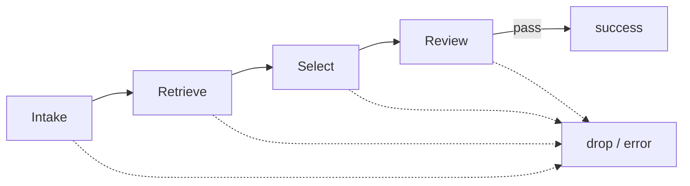
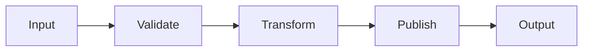
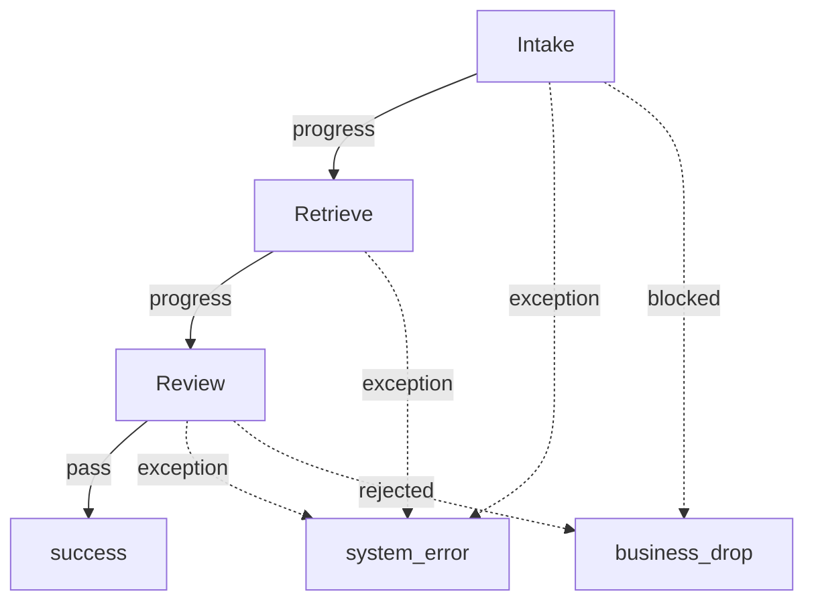
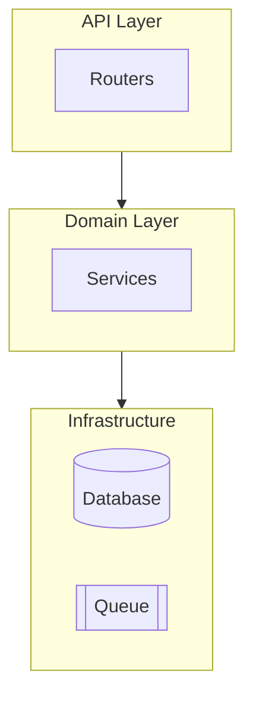
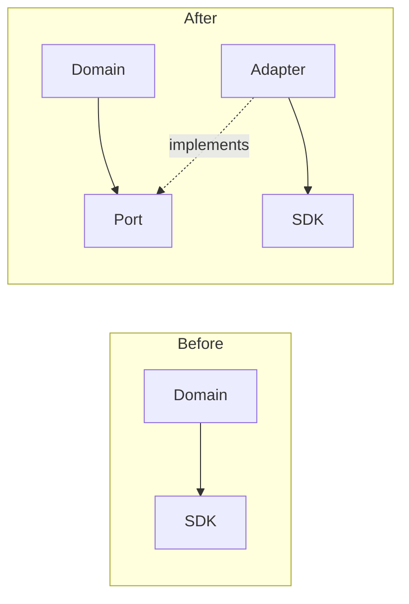
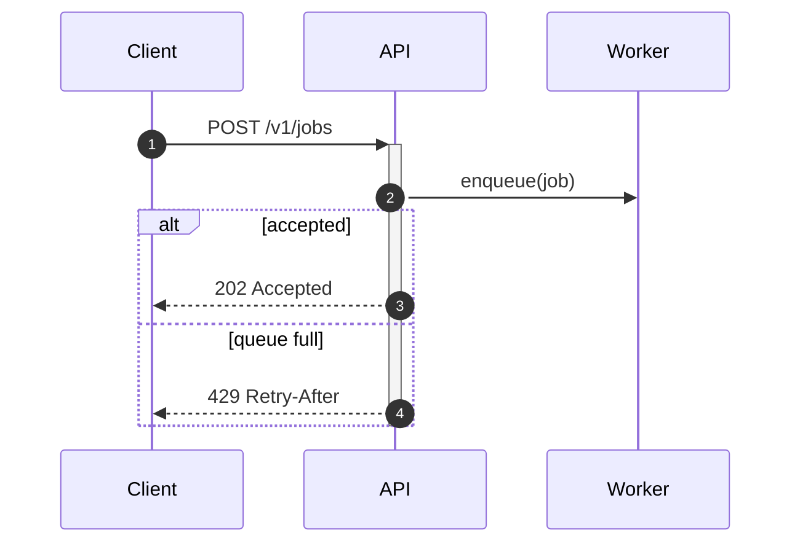
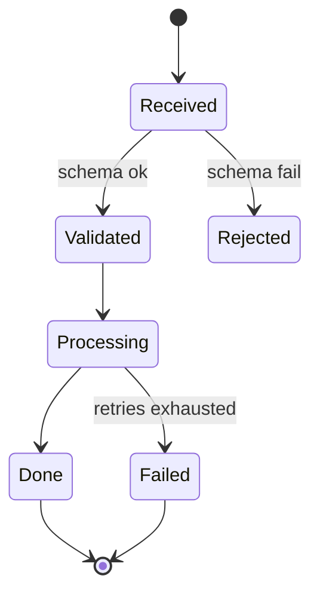
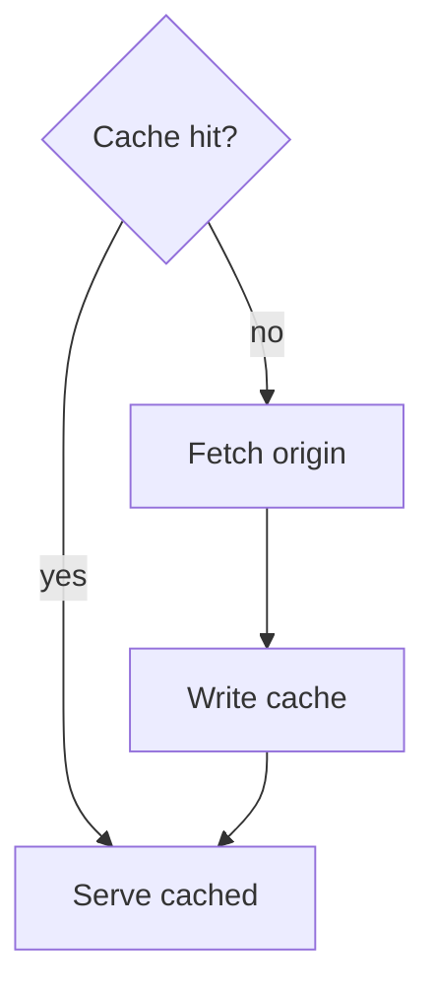

# Mermaid Diagram Catalog And Representation Patterns

Type selection, the v11 diagram catalog, and ways to render the same content detailed or compact. Verified on Mermaid v11.16.0; host support for newer types varies (see `renderer-compat.md`).

## Contents

- Type selection
- v11 catalog: newer types worth knowing
- The detail dial: compact vs detailed forms
- Core patterns

## Type Selection

Pick the type from what the reader must do, not from what the data looks like:

| Reader task | Type |
| --- | --- |
| Follow a process, branch, or funnel | `flowchart` |
| Trace who calls whom over time | `sequenceDiagram` |
| See layered ownership or system boundaries | `flowchart` + `subgraph`, or `architecture-beta` |
| Track lifecycle/status changes | `stateDiagram-v2` |
| Understand data model relations | `erDiagram` |
| Understand type/inheritance structure | `classDiagram` |
| Compare quantities or shares | usually a table or chart, not Mermaid (`pie`/`xychart-beta` only for rough shape) |
| See work stages/roles side by side | `flowchart` with lane subgraphs, or `swimlane-beta` on current renderers |

If one diagram would need two of these reader tasks, make two diagrams.

## V11 Catalog: Newer Types Worth Knowing

Fence keywords as verified on v11.16.0. Anything marked beta can change syntax and typically fails on hosts pinned below the listed version.

- `architecture-beta` (v11.1+): services, groups, and L/R/T/B port edges for cloud/deploy topology. Bundled icons are only `cloud, database, disk, internet, server`; other icons need a host-registered iconify pack.
- `block-beta` (use this keyword; plain `block` also parses on v11.16): author-controlled grid — `columns 3`, width spans (`b:2`), `space` placeholders, then explicit edges. Good for datapath/board layouts where automatic layout fights you.
- `swimlane-beta` (v11.16, syntax may evolve): flowchart syntax with lanes declared as `subgraph lane [Label]`. Prefer lane-style `flowchart` subgraphs when the host version is unknown.
- `kanban`: columns + tasks with `@{ ticket:, assigned:, priority: }` metadata.
- `packet` (v11.0+): bit-field layouts — `0-15: "Source Port"`, auto-offset `+16:` from v11.7.
- `radar-beta` (v11.6+), `treemap-beta`, `venn-beta`/`ishikawa-beta` (v11.13+), `eventmodeling` (v11.15+): niche; check host support first.
- `timeline`, `gantt`, `journey`, `mindmap`, `quadrantChart`, `gitGraph`: stable, long-supported.

## The Detail Dial: Compact Vs Detailed Forms

The same content can usually be drawn at three sizes. Choose by what the reader needs to verify, and say what you dropped when compressing.

### Compact forms (overview, README top, chat answers)

- Chain edges on one line: `IN --> Validate --> Transform --> OUT`.
- Fan out with `&`: `A --> B & C` instead of two edge lines and no more than one `&` group per line.
- Merge duplicate terminals: one `ERR[system_error]` node receiving dotted edges beats four separate error boxes.
- Replace decision diamonds with labeled edges when the branch logic is binary and obvious: `Check -->|ok| Next` / `Check -.->|fail| Retry`.
- Drop infrastructure the reader already assumes (load balancers, DNS) unless the diagram is about them.

### Detailed forms (design docs, runbooks, incident reviews)

- Subgraphs for real boundaries only: ownership, layer, runtime, network zone — with ids so they can receive edges: `subgraph api [API Layer]`.
- Markdown strings for rich labels that would otherwise need ` ` arithmetic: ``N["`**Retry policy** — 3 attempts, exponential backoff`"]`` auto-wraps.
- Sequence diagrams: `autonumber` for reviewable step references, `alt`/ `opt`/`par` blocks for branching, `Note over A,B:` for invariants worth pinning to the timeline.
- Edge ids + animation (`e1@-->`, `e1@{ animate: true }`) only for live docs sites; never for GitHub/GitLab README content.
- Keep prose in prose: a label longer than ~8 words is usually a sentence that belongs in the surrounding document with the node holding its name.

### Splitting (when the dial is not enough)

Split when one diagram mixes topology and mapping, needs ≥3 subgraph nesting levels, or exceeds roughly 12 nodes / 16 edges with real reading difficulty. Give each part its own one-line purpose; a small overview diagram followed by two focused diagrams beats one dense one.

## Core Patterns

### Linear pipeline (compact)

### Funnel with shared terminals

### Layered architecture (edges between subgraph ids)

### Before/after comparison

### Sequence interaction (numbered, with failure branch)

### State lifecycle

### Decision tree (diamonds earn their space)

