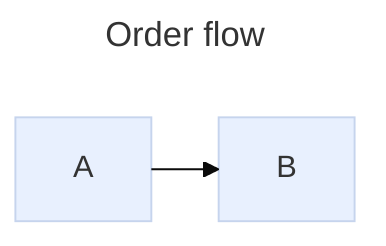

# Mermaid Syntax Pitfalls

Verified against Mermaid v11.16.0: official docs snapshot (2026-07) plus local render tests with `@mermaid-js/mermaid-cli` 11.16.0. Hosts often run older versions, so every rule below prefers the form that also works on v10/v11.4.

## Contents

- Line breaks: the `\n` trap
- Parser breakers (all diagram types)
- Flowchart traps
- Sequence traps
- State, class, and ER traps
- Escaping cheat sheet
- Config: frontmatter vs directives
- Limits and label internals

## Line Breaks: The `\n` Trap

Literal `\n` inside labels is **not** a portable line break. Render-verified behavior on v11.16.0:

| Context | `"a\nb"` renders as |
| --- | --- |
| Flowchart node label | line break (works, current versions only) |
| Flowchart edge label | line break (works, current versions only) |
| Sequence message text | literal `a\nb` on screen |
| Sequence note text | literal `a\nb` on screen |
| State transition label | literal `a\nb` on screen |

Rules:

- Always use ` ` for a forced line break. It works in every diagram type and on old renderer versions; `\n` silently degrades to visible `\n` text in half the contexts above, and VS Code preview and mermaid.live show it literally in more.
- For long flowchart labels prefer markdown strings (below): they auto-wrap and honor real newlines, so no break tags are needed at all.
- Line breaks in sequence participant names require an alias: `participant A as Alice Smith`.

## Parser Breakers (All Diagram Types)

- **Lowercase `end`** breaks flowcharts and can break sequence diagrams. Write `End`/`END`, or wrap: `E["end"]`, `(end)`, `[end]`.
- **Comments** must use `%%` at the start of their own line; `//` or `#` breaks the parse. Everything after `%%` to end of line is ignored, including diagram syntax.
- **`->` is not a flowchart arrow.** Use `-->`. Single-dash arrows produce `Expecting 'SEMI', 'NEWLINE'...` errors and are a common generated-code bug.
- **Tabs** inside diagram bodies break indentation-sensitive parsing; use spaces.
- **Malformed YAML frontmatter breaks the whole diagram**; a misspelled config key is silently ignored. The opening `---` must be the very first line of the block.
- Reserved words leak into labels: `graph`, `call`, and link targets like `_self`/`_blank` inside unquoted labels or ids cause errors (`any_api_call[...]` breaks). Quote the label and avoid keyword-suffixed ids.
- Versions 11.0–11.12 interpreted plain labels as Markdown: `1. step` became a list, backticks became codespans (`Unsupported markdown: codespan`), `=` broke sequence labels. v11.13 reverted to plain text. Version-safe rule: keep `1.`-style prefixes, bare backticks, and `*`/`_` runs out of unquoted labels; use markdown strings when you want formatting.

## Flowchart Traps

- **`o` or `x` as the first letter of a target node** becomes an edge head: `A---oB` is a circle-ended edge to node `B`, not an edge to `oB`. Add a space (`A--- oB`) or capitalize (`A---Ops`).
- **Unquoted special characters break labels**: `A[validate (strict)]` fails. Quote the whole label: `A["validate (strict)"]`. Same for `[]{}|;:&#` and leading list markers.
- **No space between a node id and its shape bracket** (`A [x]` fails), and none between a link and its pipe label.
- **Node id reuse**: the last label found for an id wins; a duplicated id silently renames the node.
- **Edge label forms**: `A -->|label| B` or `A -- label --> B`.
- **Link length**: extra dashes span more ranks (`---->` crosses extra rows); with mid-link labels the extra dashes go on the right side: `B -- No ----> E`. Use `~~~` (invisible link) purely to nudge layout.
- **Subgraph `direction` is silently ignored** when any node inside links to a node outside; the subgraph inherits the parent direction. Link to the subgraph id instead of internal nodes when internal direction matters. Subgraphs need an id to receive edges: `subgraph id [Title]`, and every `subgraph` needs its `end`.
- **`linkStyle` indexes by edge definition order** (0-based). Adding an edge earlier shifts all later indices — re-check `linkStyle` lines after any edge reorder. Prefer `linkStyle default` plus a small number of indexed overrides.
- **Commas inside `classDef` values must be escaped**: `classDef animate stroke-dasharray: 9\,5;`.
- **External CSS cannot reliably restyle nodes** (Mermaid injects scoped `!important` styles); style with `classDef`/`style` inside the diagram.

## Sequence Traps

- **Semicolons in message text** act as statement separators; encode as `#59;`.
- **Hex colors are not supported in `box`** (`#` starts entity syntax): use `box rgb(33,66,99) Label` or a color name; `box transparent Aqua` when the label itself is a color word.
- **Activation `+`/`-` must balance**: every `->>+` needs a matching `-->>-` or explicit `deactivate`; unbalanced pairs fail.
- Participant declaration order fixes left-to-right layout; declare all participants at the top, alias long names (`participant A as Auth API`).
- `create participant`/`destroy` (v10.3+): only the message **recipient** can be created; destroy errors that survive a correct fix mean the host renderer predates v10.7.
- Long messages do not wrap by default: insert ` ` or set `config: sequence: { wrap: true }`.
- All blocks (`loop`/`alt`/`else`/`opt`/`par`/`critical`/`break`/`rect`) require a closing `end` — balance them before anything else when a sequence diagram fails to parse.

## State, Class, And ER Traps

- Use `stateDiagram-v2`; plain `stateDiagram` is the legacy renderer.
- State names with spaces: declare `state "Long name" as id`, then use `id`.
- State `classDef` cannot target `[*]` start/end states or composite states; transitions between internal states of *different* composites are not supported.
- Colons inside state descriptions require v11.13+.
- Class generics use `~` (`List~int~`) and cannot contain commas; return types need a space after `()`; cardinality is quoted around the arrow: `ClassA "1" --> "0..*" ClassB : label`.
- Class relations: `<|--` inheritance, `*--` composition, `o--` aggregation, `-->` association, `..>` dependency, `..|>` realization.
- ER cardinality glyphs: `||` exactly one, `|o` zero-or-one, `}o` zero-or-more, `}|` one-or-more; `--` identifying vs `..` non-identifying: `CAR ||--o{ NAMED-DRIVER : allows`. An ER statement is all-or-nothing — adding a relationship requires the second entity *and* the `: label`.

## Escaping Cheat Sheet

- Quote any label containing `()[]{}|"#;&` or other punctuation: `A["Label (with) specials"]`.
- Entity codes work inside labels: `#quot;` → `"`, `#35;` → `#`, `#59;` → `;`, `#9829;` → ♥ (any decimal HTML code).
- Markdown strings (flowchart node/edge/subgraph labels): double quotes around backticks — ``A["`**Bold**, *italic*, auto-wrapped`"]``. They auto-wrap long text and honor real newlines; disable with `config: markdownAutoWrap: false`. Requires a current renderer with HTML labels enabled — verify host support before relying on it.
- Unicode and emoji are safe inside quoted labels: `A["Fix 🐛"]`. Bare emoji/CJK outside quotes has a history of lexical errors.
- Icons: `B["fa:fa-user Owner"]` needs the host to load Font Awesome or a registered iconify pack; otherwise the icon renders as text.

## Config: Frontmatter Vs Directives

YAML frontmatter is the recommended per-diagram config since v10.5; `%%{init: {...}}%%` directives are deprecated but remain the only option on hosts that strip or predate frontmatter.

- Useful keys: `title`, `config.theme`, `config.look` (`classic` | `handDrawn` — render-verified camelCase; flowchart and state diagrams), `config.layout` (`dagre` default, `elk`, `tidy-tree`), `config.themeVariables`, `config.flowchart.curve`, top-level `config.htmlLabels` (`flowchart.htmlLabels` deprecated since v11.12.3).
- `securityLevel`, `startOnLoad`, `maxTextSize` are host-controlled and not overridable from a diagram. `click`/`link` interactivity requires the host to run `securityLevel: loose` — treat links as best-effort decoration.
- ELK ships as a separate package; when `layout: elk` silently renders as dagre, the host has not registered it. Simplify structure instead of depending on the layout engine.

## Limits And Label Internals

- `maxTextSize` defaults to 50,000 characters; `maxEdges` defaults to 500 for flowcharts. Exceeding either throws — split the diagram long before these limits for readability anyway.
- Since v9.2 labels render as HTML `<foreignObject>` by default. This breaks some SVG-to-PNG pipelines and strict-CSP embedders; `htmlLabels: false` forces native SVG text (losing ` ` becomes tspan-wrapping, markdown strings still wrap). If exported PNGs show empty labels, this is why.
