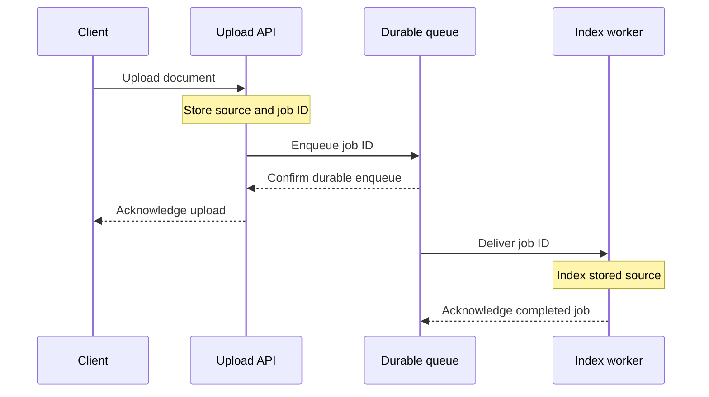

# Finished Examples

Use the matching sample when planning or restructuring a technical explanation, measured comparison, or proposal. Each combines the necessary prose with a focused display. All systems, events, and measurements below are independently synthetic teaching cases, not reported results. Sample headings and blocks are illustrative, not a required outline.

## Technical explanation

Reader: an engineer learning what acknowledgement means in a queued upload service.

### Upload acknowledgement and search visibility

A queued upload service acknowledges a document after storing its source and a durable indexing job. The worker makes the document searchable independently of the upload response. A successful upload response therefore means the service has accepted the work; it does not mean that search can return the document yet.

For example, after receiving an upload acknowledgement, a client can request the document by ID while a keyword query still returns no match. These operations read different stores: ID lookup reads the stored source, while keyword search reads the index.

### Indexing sequence

The upload response does not wait for indexing. If the worker fails before acknowledging its job, the queue can deliver that job again. Writing the same document ID replaces its index entry, so a retry does not create a duplicate search result.

**Technique:** the observable contract precedes the implementation, as in [Rust RFC 2394](https://github.com/rust-lang/rfcs/blob/f17e8623ee2e2854570dcdb936a9f4ab08c0fcd4/text/2394-async_await.md) and [MapReduce](https://research.google/pubs/mapreduce-simplified-data-processing-on-large-clusters/). The same source and job names connect the example, diagram, and recovery explanation. The diagram shows one successful sequence, and the adjacent paragraph supplies the retry rule. Draw a separate failure sequence only when recovery needs further explanation.

## Measured comparison

Reader: an engineer deciding whether faster acknowledgements justify delayed search visibility.

### Upload and indexing latency

Queued indexing reduced median acknowledgement latency in this replay, but documents became searchable later. The replay used the same 600 documents, eight concurrent clients, and one index worker. Each configuration completed all 600 uploads; latency includes retries.

| Configuration | Median acknowledgement | Median search visibility |
| --- | ---: | ---: |
| Index before acknowledgement | 720 ms | 720 ms |
| Queue before acknowledgement | 90 ms | 2.8 s |

Acknowledgement and search visibility are both measured from request arrival. The queued configuration returns after durable enqueue, while its search delay includes time waiting for the worker. The direct configuration waits for indexing before acknowledging.

### Selection criterion

Use queued indexing when upload acknowledgement and later search visibility fit the product's behavior. Keep direct indexing when a successful upload must be immediately searchable. This replay does not establish queue delay under sustained traffic; that condition needs a sustained-load measurement before selecting a production capacity.

**Technique:** a compact table carries comparable values and a named row entity. Local conditions define what the values mean; the following prose explains the cost of the mechanism. This applies the result-specific qualification in [PEP 703](https://peps.python.org/pep-0703/#performance). It does not transfer that source's numbers or claim that one replay proves capacity. A chart would add little to this small exact-value comparison.

## Technical proposal

Reader: a maintainer choosing how a nightly file import should recover from an interruption.

### Proposed import recovery

Store the source offset in the same database transaction as each imported batch. A restart can then continue from the last committed offset without repeating completed batches. The current importer restarts at the beginning of the file, making recovery time depend on how much work had already completed.

### Recovery alternatives

| Recovery method | Restart point | Additional persistent state |
| --- | --- | --- |
| Full-file replay | First record | None |
| Per-batch checkpoint | Last committed batch | Source ID and offset |

Choose per-batch checkpoints for long imports with stable input files. Writing the checkpoint and batch together prevents a checkpoint from advancing past uncommitted data. Bind each checkpoint to a content hash of the source file; reject a resume when the file has changed. Full-file replay remains simpler for short imports whose replay cost is negligible.

### Implementation work

- Transaction boundary
  - Commit the imported records and checkpoint together.
  - Retain the previous checkpoint if the transaction rolls back.
- Recovery verification
  - Test interruptions around commit.
    - Before commit: the batch and checkpoint both remain unchanged.
    - After commit: the restart begins with the next batch.
  - Reject a checkpoint whose source hash differs from the input file.

**Technique:** the recommendation states the change directly, the table isolates the alternatives, and the explanation names the deciding condition. The nested list distinguishes work from the cases within a check. This transfers the reader-specific choice and alternatives in [Google's design-doc discussion](https://abseil.io/resources/swe-book/html/ch10.html), without importing its review organization or narrating who proposed the change.

## Transfer boundaries

For an incident record, borrow the precise headings, explicit row labels, grouped observations, and limited visual scope. Use a timeline or event table when sequence is the reader's question. The [SRE example](https://sre.google/sre-book/example-postmortem/) is useful for that purpose; its incident structure does not replace the mechanism and alternatives needed above.

For a more involved explanation, keep one running problem and add complexity where the previous model stops answering it. [Red Blob's pathfinding introduction](https://www.redblobgames.com/pathfinding/a-star/introduction.html) uses path costs and heuristic choices this way. [Distill's momentum article](https://distill.pub/2017/momentum/) starts with a simple mathematical model before expanding the explanation. Transfer that staged reasoning; do not assume every document needs an interactive graphic or every topic admits the same simplification.

Use [Circuit Tracing](https://transformer-circuits.pub/2025/attribution-graphs/methods.html) when explaining an investigation: distinguish the instrument's observation from an inferred mechanism, then identify the intervention that tests it. A particular counterexample can explain a model's limit more usefully than a blanket warning attached to the whole document.
